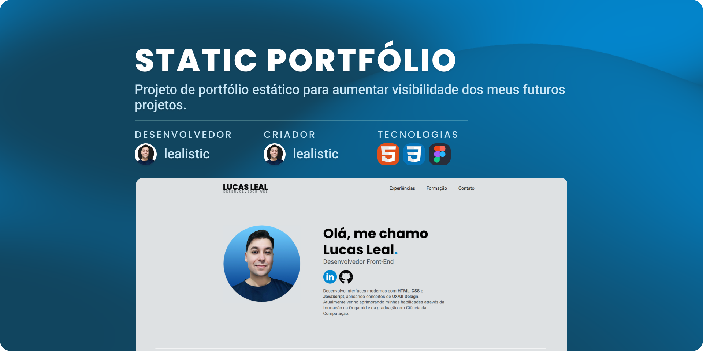

<h1 align="center">Static Portfólio</h1>

<!--Pontos de Navegação-->

  <a href="#-tecnologias">Tecnologias</a>&nbsp;&nbsp;&nbsp;|&nbsp;&nbsp;&nbsp;
  <a href="#-projeto">Projeto</a>&nbsp;&nbsp;&nbsp;|&nbsp;&nbsp;&nbsp;
  <a href="#memo-licença">Licença</a>

  

 

  

## 🚀 Tecnologias

Esse projeto foi desenvolvido com as seguintes tecnologias:

📌 HTML5
📌 CSS3
📌 Figma

## 💻 Projeto

Projeto desenvolvido durante o curso da Origamid e projetado no Figma, com o objetivo de criar um portfólio estático responsivo para exibição de futuros projetos. Esse projeto aplica:

✔ HTML Semântico para melhor estruturação;

✔ Divisão em múltiplos arquivos CSS utilizando `@import`;

✔ Uso do cleancss para a otimização do arquivo final `style.min.css`;

✔ Layouts com Grid e Flexbox para alinhamento responsivo;

✔ Media Queries para adaptação a diferentes telas;

✔ Acessibilidade com atributos como aria-labelledby para leitores de tela.

✔ Conceitos de UI Design como Tipografia, Espaçamento, Formas e Cores.

🔗 [Acesse o projeto finalizado, online](https://lealistic.github.io/static-portfolio/)

🔗 [Acesse o figma deste projeto](https://www.figma.com/design/VA9Xsx0Ij3m2ZY1WfZ16Ud/Projeto-Portf%C3%B3lio?m=auto&t=FY45hHy60aXNRHRl-1)

## 📝 Licença

Esse projeto está sob a licença MIT.
